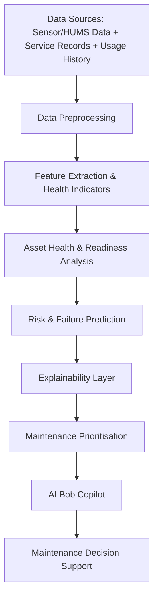
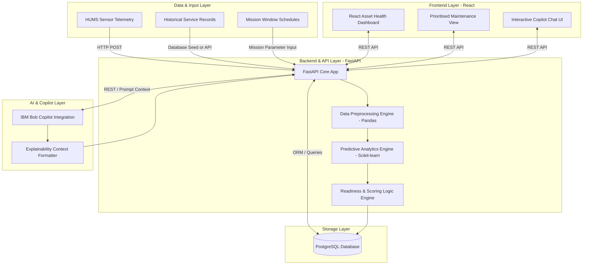
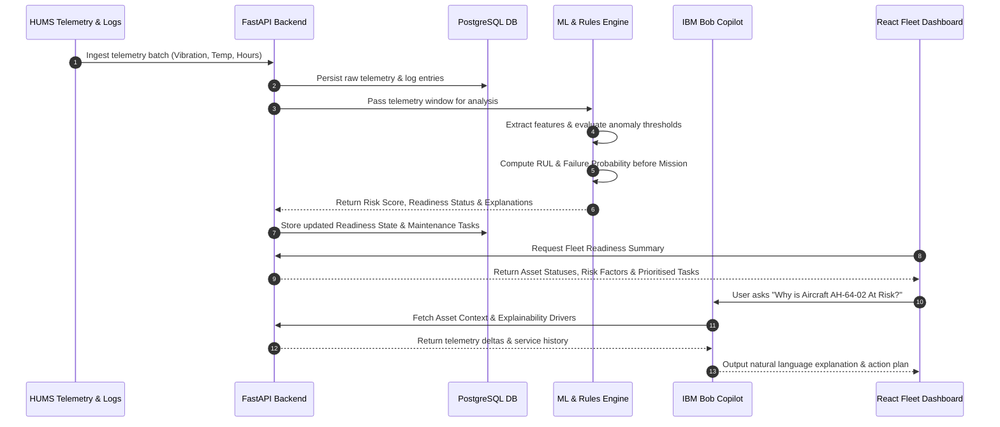
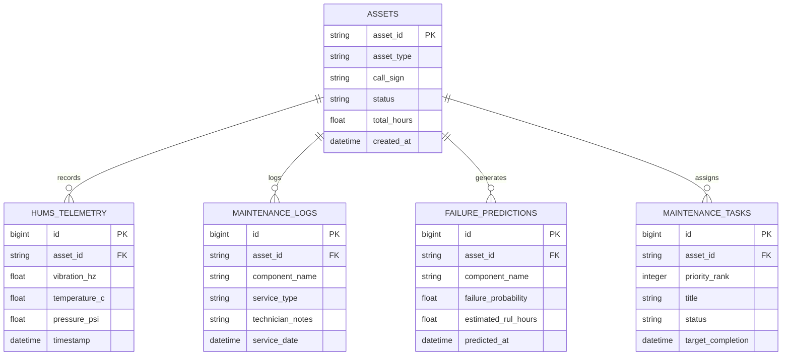

# 🛡️ MissionReady Copilot

> **AI-Powered Mission Readiness & Predictive Maintenance Copilot for Military & Enterprise Assets**

[](https://github.com/)
[](https://fastapi.tiangolo.com/)
[](https://nextjs.org/)
[](https://www.postgresql.org/)
[](https://www.ibm.com/)
[](https://hub.docker.com/u/darshitsorathiya)
[](LICENSE)

---

## 👥 Team Information

* **Team Name:** Chatpate-4
* **Track:** AI Track
* **Team Leader:** Darshit Sorathiya — `23dce117@charusat.edu.in`
* **Team Members:**
  * Tulsi Dhameliya — `24dce031@charusat.edu.in`
  * Mahi Pandey — `23dce072@charusat.edu.in`
  * Shreyan Varsani — `23dce125@charusat.edu.in`

---

## 🎯 Problem Statement

### Real-World Challenge
Military organisations and high-consequence operational fleets manage complex assets including fixed-wing aircraft, rotary-wing platforms, armored ground vehicles, and heavy support equipment. Determining whether an asset is truly **mission-ready** before deployment is a critical operational challenge.

### Limitations of Fixed Maintenance Schedules
Traditionally, maintenance in defense and aerospace relies on **fixed calendar schedules** or **fixed operating hour intervals** (e.g., servicing an engine every 200 flight hours or every 6 months). This approach presents major limitations:
* **Over-maintenance of healthy components:** Scheduled tear-downs consume labor and material resources on parts that remain in optimal condition.
* **Failure to detect premature component failure:** High stress, harsh operational environments, or latent manufacturing defects cause components to fail long before their scheduled maintenance date.

### The Role of HUMS (Health & Usage Monitoring System) Sensor Data
Modern platforms are equipped with **HUMS (Health & Usage Monitoring Systems)** generating rich telemetry:
* Vibration frequencies and amplitudes (bearing and gearbox health)
* Operating temperatures (engine oil, hydraulic fluid, rotor assemblies)
* Fluid pressure readings and flow rate deltas
* Structural stress metrics and cycle counts

However, this data often remains **isolated, fragmented, and underanalysed** across disparate databases and manual logbooks.

### Operational Impact of Unexpected Failures
When an unscheduled failure occurs during or immediately prior to a mission window:
1. Operational readiness drops unexpectedly, compromising mission success.
2. Missions are delayed, aborted, or executed with degraded capabilities.
3. Rapid emergency repairs require emergency logistics pipelines, taking days or weeks for platform recovery.

---

## 💡 Our Solution

**MissionReady Copilot** bridges the gap between raw sensor telemetry, historical maintenance records, and operational decision-making. 

Our system continuously ingests real-time and batch HUMS telemetry alongside historical maintenance logs to provide an intelligent, explainable decision-support dashboard and conversational AI assistant for maintenance personnel and fleet commanders.

```
┌────────────────────────┐     ┌────────────────────────┐     ┌────────────────────────┐
│  HUMS Telemetry Ingest │ ──► │ Predictive Analytics   │ ──► │  Mission Readiness     │
│  & Service Logs        │     │  & Failure Forecasting │     │  Assessment            │
└────────────────────────┘     └────────────────────────┘     └────────────────────────┘
                                                                          │
                                                                          ▼
┌────────────────────────┐     ┌────────────────────────┐     ┌────────────────────────┐
│  Maintenance Decision  │ ◄── │  AI Bob Copilot        │ ◄── │  Explainability &      │
│  Prioritisation        │     │  Conversational Engine │     │  Root-Cause Driver     │
└────────────────────────┘     └────────────────────────┘     └────────────────────────┘
```

### Core Solution Capabilities
1. **Sensor & HUMS Data Ingestion:** Automated streaming and batch ingestion of high-frequency sensor readings (vibration, temperature, pressure, operating hours).
2. **Historical Log Integration:** Processing historical service logs, overhaul history, part replacement ages, and recurring maintenance flags.
3. **Asset Health & Readiness Assessment:** Real-time calculation of overall asset status (`Ready`, `At Risk`, `Non-Ready`) based on multi-parameter health indices.
4. **Abnormal Sensor Behavior Detection:** Automated detection of anomalous telemetry spikes and trend drifts using statistical baselines and machine learning.
5. **Explainable Risk Analysis:** Transparent root-cause breakdowns answering *why* an asset is classified as at-risk.
6. **Component Failure Prediction:** Forecasting component failure probabilities and Remaining Useful Life (RUL) relative to upcoming mission duration windows.
7. **Prioritised Maintenance Recommendations:** Scoring and ranking maintenance actions based on failure risk, mission criticality, and intervention urgency.
8. **AI / Bob Copilot Interface:** An interactive natural-language assistant powered by IBM Bob, enabling maintenance leads to query platform health, inspect risk factors, and generate maintenance briefings instantly.

---

## ⚙️ How the System Works

The end-to-end workflow transforms raw sensor signals into prioritised operational maintenance decisions through a multi-stage pipeline:



### End-to-End Workflow Breakdown
1. **Ingestion:** Telemetry data (vibration Hz, temperature °C, hydraulic PSI) and service log events are received via REST endpoints.
2. **Preprocessing & Feature Extraction:** Raw data streams are cleaned, normalized, and transformed into moving-average health indicators and deviation deltas.
3. **Readiness Evaluation:** The readiness rules engine checks component metrics against safe operating thresholds and active maintenance status flags.
4. **Predictive Modeling:** The ML engine calculates component failure probabilities and Remaining Useful Life (RUL) forecasts for the requested mission window.
5. **Explainability Generation:** Significant contributing risk drivers (e.g., "+35% rotor vibration spike over baseline") are identified and formatted into natural-language explanations.
6. **Prioritisation:** Tasks are ranked according to a multi-factor priority score ($Score = Risk \times Urgency \times Criticality$).
7. **Copilot & Interface Delivery:** Insights are exposed via the React Dashboard and conversational IBM Bob Copilot API for real-time operator queries.

---

## 🏗️ System Architecture

The architecture follows a decoupled, modular design ensuring clear separation between data storage, machine learning inference, API business logic, conversational AI integration, and the frontend presentation layer.



### Architecture Component Responsibilities
* **Frontend (React):** Delivers an intuitive military-grade command dashboard for viewing platform readiness, inspecting telemetry graphs, managing maintenance task queues, and chatting with Bob Copilot.
* **Backend API (FastAPI):** High-performance Python backend serving REST endpoints, orchestrating data pipelines, and maintaining business logic.
* **Data Processing & ML (Pandas / Scikit-learn):** Handles feature extraction, moving window statistics, anomaly detection models, and RUL estimation algorithms.
* **Database (PostgreSQL):** Relational storage engine persisting asset metadata, component telemetry history, maintenance work orders, and failure prediction logs.
* **AI Copilot (IBM Bob):** Intelligent conversational layer capable of parsing natural-language fleet queries and synthesizing context-aware maintenance recommendations.

---

## 🔄 Data Flow Diagram



---

## 🚦 Mission Readiness Logic

Assets in the fleet are dynamically classified into one of three distinct operational readiness states based on quantitative sensor thresholds, predictive failure risks, and active maintenance flags.

```
                     ┌───────────────────────────────┐
                     │     Telemetry & Logs Ingest   │
                     └───────────────┬───────────────┘
                                     │
                     ┌───────────────┴───────────────┐
                     │ Check Critical Failures &     │
                     │ High Anomaly Spikes           │
                     └───────┬───────────────┬───────┘
                             │               │
                     YES ┌───┴───┐       NO ┌┴──────────┐
                         │       │          │           │
                         ▼       │          ▼           │
                 ┌───────────────┐  ┌───────────────────┐
                 │  NON-READY    │  │ Check Predictive  │
                 │  (Red)        │  │ Failure Risk      │
                 └───────────────┘  └───────┬───────────┘
                                            │
                                    YES ┌───┴───┐       NO ┌──────────┐
                                        │       │          │          │
                                        ▼       │          ▼          │
                                ┌───────────────┐  ┌──────────────────┐
                                │   AT RISK     │  │      READY       │
                                │   (Yellow)    │  │     (Green)      │
                                └───────────────┘  └──────────────────┘
```

### Readiness Classifications & Threshold Criteria

| Status State | Dashboard Indicator | Condition Criteria | Operational Decision |
|---|---|---|---|
| **Ready** | 🟢 **Green** | All HUMS telemetry within normal range ($\pm 1 \sigma$); predicted failure risk $< 15\%$ for mission window; zero overdue critical service tasks. | Approved for full mission deployment without restrictions. |
| **At Risk** | 🟡 **Yellow** | Telemetry trends showing early anomaly drift ($1\sigma - 2.5\sigma$); predicted failure risk between $15\% - 45\%$ before mission end; approaching overhaul operating hours ($> 85\%$ MTBF). | Conditional deployment permitted only for short-duration or low-stress missions; targeted maintenance recommended. |
| **Non-Ready** | 🔴 **Red** | Severe telemetry anomaly breach ($> 2.5\sigma$ limit); active critical component failure warning; predicted failure risk $> 45\%$; open high-severity maintenance work order. | Grounded / Taken out of service immediately; mandatory maintenance intervention required prior to mission clearance. |

---

## 🔮 Predictive Maintenance Engine

The predictive engine shifts maintenance from reactive calendar schedules to proactive condition-based planning.

### Data Inputs Utilized
* **HUMS Sensor Telemetry:** Rolling window timeseries for vibration peak-to-peak amplitude (mm/s), bearing vibration frequency spectra, engine oil temperature (°C), hydraulic pressure (PSI), and thermal deltas.
* **Component Operating Hours:** Total accumulated flight/operating hours since initial commissioning and since last overhaul.
* **Service Log History:** Historical record of component replacements, overhaul notes, reported transient faults, and technician service logs.

### Component Health Indicators & Anomaly Detection
1. **Vibration Anomaly Index:** Measures deviation from historical baseline vibration levels on main gearboxes, rotor shafts, and engine turbines.
2. **Thermal Variance Score:** Tracks temperature rise rates relative to engine load to detect friction, cooling degradation, or lubrication loss.
3. **Pressure Stability Factor:** Analyzes hydraulic and fuel pressure fluctuations to spot pump cavitations or seal micro-leaks.

### Risk Estimation & Mission Window Alignment
The system evaluates failure probability over a defined **Mission Window** ($H_{mission}$, e.g., 24 hours, 50 flight hours):

$$P(\text{Failure}) = f\left(\text{Vibration Delta}, \text{Thermal Delta}, \frac{\text{Hours Elapsed}}{\text{MTBF}}, \text{Unresolved Logs}\right)$$

If the estimated Remaining Useful Life (RUL) $RUL < H_{mission} \times 1.25$ (25% safety margin), the component risk score escalates automatically, converting risk metrics into prioritised maintenance orders.

---

## 🔍 Explainability ("Why is this asset at risk?")

A core strength of MissionReady Copilot is its **transparent explainability layer**. Rather than outputting an opaque risk percentage, the system isolates specific root-cause contributing factors.

### Concrete Explainability Examples

#### Scenario A: Helicopter Tail Rotor Shaft At Risk
> **Asset ID:** `AH-64-02` | **Status:** 🟡 **At Risk** (Failure Risk: 38%)  
> **Primary Risk Drivers:**
> * 📈 **Vibration Spike:** Tail rotor bearing vibration reached **4.8 mm/s** (Baseline normal: 2.1 mm/s, Threshold limit: 5.0 mm/s). Trend shows a 42% increase over the last 15 flight hours.
> * ⏱️ **Overhaul Proximity:** Component operating hours at **485 hrs** (Recommended overhaul interval: 500 hrs).
> * 📝 **Service Log Context:** Past 3 service logs recorded recurring minor vibration notes during high-pitch maneuvers.

#### Scenario B: Armored Transport Main Hydraulics Non-Ready
> **Asset ID:** `APC-88-09` | **Status:** 🔴 **Non-Ready** (Failure Risk: 74%)  
> **Primary Risk Drivers:**
> * 📉 **Hydraulic Pressure Drop:** Main pump pressure dropped to **2,100 PSI** under load (Standard operational minimum: 2,800 PSI).
> * 🌡️ **Thermal Elevation:** Hydraulic oil temperature spiked to **102°C** (Normal max envelope: 88°C).
> * ⚠️ **Immediate Threat:** Fluid seal failure highly probable within next 5 operational hours.

---

## 📋 Maintenance Prioritisation Logic

Maintenance work orders are dynamically ranked using a calculated **Priority Score ($P_s$)** to ensure ground crews focus on interventions that maximize fleet readiness:

$$P_s = (W_{risk} \times R) + (W_{urgency} \times U) + (W_{impact} \times I)$$

Where:
* $R$ = **Failure Risk Score** (0–100% based on ML prediction and anomaly severity)
* $U$ = **Intervention Urgency** (Inversely proportional to remaining time before next scheduled mission departure)
* $I$ = **Asset & Mission Criticality** (Strategic importance of asset type to planned operations)
* $W_{risk}, W_{urgency}, W_{impact}$ = Configurable weighting coefficients ($0.45, 0.35, 0.20$)

### Priority Ranking Matrix
1. **Priority 1 (Critical / Immediate):** High failure probability on high-criticality assets scheduled for immediate missions.
2. **Priority 2 (High / Pre-Mission):** Moderate-to-high risk components that will breach safety margins during the upcoming mission window.
3. **Priority 3 (Medium / Scheduled Window):** Components exhibiting early anomaly drift but with sufficient RUL to complete current mission obligations.
4. **Priority 4 (Low / Routine):** Standard routine servicing and minor log inspections.

---

## 🤖 AI / Bob Copilot Interface

The **Bob Copilot** provides an intuitive natural-language interface powered by IBM Bob technology, serving as a virtual maintenance advisor for fleet commanders and ground technicians.

```
 💬 USER: "Copilot, brief me on fleet readiness for Mission Bravo tomorrow morning."

 🤖 BOB COPILOT:
 "Fleet Readiness Summary for Mission Bravo (12 Platforms Scheduled):
 
  • 9 Platforms READY 🟢
  • 2 Platforms AT RISK 🟡 (AH-64-02, CH-47-05)
  • 1 Platform NON-READY 🔴 (APC-88-09 - Grounded)
 
 Key Risk Insight:
 Aircraft AH-64-02 exhibits a 42% increase in tail rotor vibration (4.8 mm/s) 
 with 485/500 hours elapsed. Estimated RUL is 18 hours, which falls below 
 the 24-hour Mission Bravo requirement.
 
 Recommended Action:
 Reallocate tail rotor bearing replacement task #M-402 to Priority 1 tonight. 
 Estimated maintenance duration: 3.5 hours."
```

### Implemented vs. Planned Copilot Capabilities

| Feature Capability | Implementation Status | Functional Details |
|---|---|---|
| **Asset Readiness Queries** | ✅ **Implemented** | Query current status (`Ready`, `At Risk`, `Non-Ready`) across platforms. |
| **Explainable Risk Summaries** | ✅ **Implemented** | Synthesize sensor anomalies and service log notes into natural text. |
| **Prioritised Maintenance Briefs** | ✅ **Implemented** | Generate ranked maintenance action lists for upcoming mission windows. |
| **Interactive Telemetry Filtering** | ✅ **Implemented** | Filter assets by component type, risk level, or telemetry thresholds via prompt commands. |
| **Automated Parts Requisition** | 🔮 **Planned (Future Scope)** | Direct integration with military ERP / inventory databases for automatic spare part holds. |
| **Voice Command Input** | 🔮 **Planned (Future Scope)** | Speech-to-text input for hands-free maintenance operations on flightlines. |

---

## ⭐ Key Features

* 📊 **Real-Time Readiness Dashboard:** Visual fleet overview categorizing assets into Ready, At Risk, and Non-Ready operational statuses.
* 📈 **HUMS Telemetry Telematics Monitor:** High-resolution charts tracking vibration amplitudes, thermal deltas, and pressure curves over time.
* 🤖 **IBM Bob AI Copilot:** Interactive natural-language interface for fleet status querying, risk inspection, and maintenance summaries.
* 🧠 **Predictive Failure Analytics:** ML-driven estimation of component failure probabilities and Remaining Useful Life (RUL).
* 🔎 **Transparent Explainability Layer:** Detailed root-cause attribution pinpointing why specific assets are flagged at risk.
* 🎯 **Smart Maintenance Prioritiser:** Algorithmic work order ranking optimizing technician allocation against mission timelines.
* 📝 **Integrated Service Log History:** Centralized historical service records matching sensor anomaly timestamps with maintenance logs.
* 🐳 **Containerized & REST API Driven:** Fully modular architecture powered by FastAPI and ready for containerized deployment.

---

## 🛠️ Technology Stack

| Layer / Domain | Technology | Purpose & Rationale |
|---|---|---|
| **Programming Languages** | `Python 3.11` | Primary language for backend API, data processing, and predictive ML models. |
| | `JavaScript / JSX` | Used for building modern, responsive interactive web UI dashboards. |
| **Backend Framework** | `FastAPI` | Asynchronous, high-performance Python web framework for REST API endpoints and OpenAPI docs. |
| **Frontend Framework** | `React 18` | Component-based frontend library enabling reactive UI state updates and real-time telemetry visualizations. |
| **AI / Copilot Engine** | `IBM Bob` | Conversational AI orchestration layer for natural language context retrieval and maintenance reasoning. |
| **Database** | `PostgreSQL` | Robust relational database for persistent storage of asset metadata, telemetry history, and maintenance logs. |
| **Data & ML Libraries** | `Pandas` | High-performance data manipulation and timeseries window transformations. |
| | `Scikit-learn` | Machine learning algorithms for anomaly scoring, regression-based RUL estimation, and risk classification. |
| | `Uvicorn` | Lightning-fast ASGI web server for serving FastAPI endpoints. |
| **DevOps & Tooling** | `Docker` | Application containerization for reproducible development and deployment environments. |
| | `Git` | Distributed version control and collaboration management. |

---

## 📦 Dependencies

The project relies on production-grade Python and JavaScript libraries listed below:

### Backend Dependencies (Python)

| Package | Version | Purpose | Usage Location |
|---|---|---|---|
| `fastapi` | `^0.109.0` | Core REST API framework | `src/backend/app/main.py` |
| `uvicorn` | `^0.27.0` | ASGI server execution | `src/backend/app/main.py` |
| `pandas` | `^2.2.0` | Telemetry timeseries processing | `src/backend/app/analytics/` |
| `scikit-learn` | `^1.4.0` | Anomaly detection & RUL models | `src/backend/app/models/` |
| `numpy` | `^1.26.0` | Numerical calculations & matrices | `src/backend/app/analytics/` |
| `psycopg2-binary` | `^2.9.9` | PostgreSQL database driver | `src/backend/app/database/` |
| `sqlalchemy` | `^2.0.25` | Database ORM & query builder | `src/backend/app/database/` |
| `pydantic` | `^2.6.0` | Request payload schema validation | `src/backend/app/schemas/` |
| `python-dotenv` | `^1.0.1` | Environment variable management | `src/backend/app/config.py` |

### Frontend Dependencies (JavaScript / Node)

| Package | Version | Purpose | Usage Location |
|---|---|---|---|
| `react` | `^18.2.0` | Core UI library | `src/frontend/src/` |
| `react-dom` | `^18.2.0` | DOM rendering layer | `src/frontend/src/index.js` |
| `axios` | `^1.6.7` | HTTP client for REST API calls | `src/frontend/src/services/` |
| `recharts` | `^2.10.0` | Interactive telemetry charting | `src/frontend/src/components/` |
| `lucide-react` | `^0.323.0` | UI icon components | `src/frontend/src/components/` |

---

## 📋 Prerequisites

### Docker setup (recommended — no Python or Node required)
* **Docker** v24+ — [install guide](https://docs.docker.com/get-docker/)
* **Docker Compose** v2.20+ (bundled with Docker Desktop; or `docker compose version`)

### Local / manual setup
* **Python** 3.12+ (`python --version`)
* **Node.js** 20+ (`node -v`)
* **PostgreSQL** 15+
* **IBM watsonx.ai** credentials (API key + Project ID) for the AI copilot

---

## 🔐 Environment Variables

There is **one shared file** — `src/.env` — that both the backend and the frontend read. You never need a separate `src/frontend/.env.local`.

```bash
cp src/.env.example src/.env
```

Open `src/.env` and fill in the required values:

| Variable | Required | Description |
|---|---|---|
| `DATABASE_URL` | ✅ | PostgreSQL connection string (psycopg v3 prefix) |
| `JWT_SECRET_KEY` | ✅ | ≥ 32 random bytes — generate below |
| `WATSONX_API_KEY` | ✅ | IBM Cloud API key |
| `WATSONX_PROJECT_ID` | ✅ | IBM watsonx.ai project ID |
| `WATSONX_URL` | ✅ | `https://us-south.ml.cloud.ibm.com` |
| `NEXT_PUBLIC_API_URL` | ✅ | URL the **browser** uses to reach the backend |
| `GROQ_API_KEY` | ⚠️ optional | Fallback LLM if watsonx.ai is unavailable |
| `GOOGLE_CLIENT_ID` | ⚠️ optional | Enables Google Sign-In |
| `SLACK_WEBHOOK_URL` | ⚠️ optional | Slack notifications |

Generate a secure `JWT_SECRET_KEY`:
```bash
python3 -c "import secrets; print(secrets.token_hex(32))"
```

> ⚠️ **Never commit `src/.env`** — it is listed in `.gitignore`.

---

## 🚀 Setup & Running

### ✅ Option 1 — Docker Hub (fastest, no clone needed)

Pre-built images are published to Docker Hub under [`darshitsorathiya/missionready-backend`](https://hub.docker.com/r/darshitsorathiya/missionready-backend) and [`darshitsorathiya/missionready-frontend`](https://hub.docker.com/r/darshitsorathiya/missionready-frontend).

**Step 1 — Get the compose file and env template**
```bash
# Option A: clone the repo
git clone https://github.com/DarshitSorathiya/bob-ai-hackathon-Chatpate-4.git
cd bob-ai-hackathon-Chatpate-4

# Option B: download just the two files you need
curl -O https://raw.githubusercontent.com/DarshitSorathiya/bob-ai-hackathon-Chatpate-4/main/docker-compose.prod.yml
mkdir -p src
curl -o src/.env https://raw.githubusercontent.com/DarshitSorathiya/bob-ai-hackathon-Chatpate-4/main/src/.env.example
```

**Step 2 — Configure `src/.env`**
```bash
# If you cloned:
cp src/.env.example src/.env
nano src/.env   # fill in JWT_SECRET_KEY, WATSONX_API_KEY, etc.
```

**Step 3 — Pull images and start**
```bash
DOCKERHUB_USERNAME=darshitsorathiya docker compose -f docker-compose.prod.yml up -d
```

**Step 4 — Open the app**
| Service | URL |
|---|---|
| Frontend dashboard | http://localhost:3000 |
| Backend API | http://localhost:8000 |
| API docs (Swagger) | http://localhost:8000/docs |

---

### 🛠️ Option 2 — Build from source (Docker)

Use this when you have made local code changes and want to build fresh images.

**Step 1 — Clone**
```bash
git clone https://github.com/DarshitSorathiya/bob-ai-hackathon-Chatpate-4.git
cd bob-ai-hackathon-Chatpate-4
```

**Step 2 — Configure**
```bash
cp src/.env.example src/.env
nano src/.env   # fill in required values
```

**Step 3 — Build and run**
```bash
docker compose up --build -d
```

Migrations run automatically before the backend starts.

**Step 4 — Open the app**
| Service | URL |
|---|---|
| Frontend dashboard | http://localhost:3000 |
| Backend API | http://localhost:8000 |
| API docs (Swagger) | http://localhost:8000/docs |

---

### 💻 Option 3 — Run without Docker (manual)

Use this for active development with hot-reload on both services.

**Step 1 — Clone and configure**
```bash
git clone https://github.com/DarshitSorathiya/bob-ai-hackathon-Chatpate-4.git
cd bob-ai-hackathon-Chatpate-4
cp src/.env.example src/.env
nano src/.env   # fill in required values (use localhost for DATABASE_URL)
```

**Step 2 — Backend**
```bash
cd bob-ai-hackathon-Chatpate-4
python3 -m venv .venv
source .venv/bin/activate          # Windows: .venv\Scripts\activate

pip install -r src/backend/requirements.txt

cd src/backend
alembic upgrade head               # run DB migrations
uvicorn app.main:app --host 127.0.0.1 --port 8000 --reload
```

**Step 3 — Frontend** (new terminal)
```bash
cd src/frontend
npm install
npm run dev
```

---

## 🐳 Docker Reference

### Common commands
```bash
# View running containers
docker compose ps

# Stream logs for all services
docker compose logs -f

# Stream logs for one service
docker compose logs -f backend

# Stop (keep database volume)
docker compose down

# Stop and wipe database
docker compose down -v

# Rebuild after code changes
docker compose up --build -d

# Update to latest Hub images
DOCKERHUB_USERNAME=darshitsorathiya \
  docker compose -f docker-compose.prod.yml pull && \
  docker compose -f docker-compose.prod.yml up -d
```

### Pin a specific release
```bash
IMAGE_TAG=v1.2.0 DOCKERHUB_USERNAME=darshitsorathiya \
  docker compose -f docker-compose.prod.yml up -d
```

### Run on another PC
1. Install Docker on the target machine
2. Copy `docker-compose.prod.yml` and `src/.env` to the machine
3. Set `NEXT_PUBLIC_API_URL=http://<machine-ip>:8000/api/v1` in `src/.env`
4. Run `DOCKERHUB_USERNAME=darshitsorathiya docker compose -f docker-compose.prod.yml up -d`

---

## 📁 Project Structure

```text
bob-ai-hackathon-Chatpate-4/
│
├── docker-compose.yml            # Local dev — builds images from source
├── docker-compose.prod.yml       # Production — pulls from Docker Hub
├── README.md
├── CONTRIBUTING.md
├── AGENTS.md
├── submission.yaml
│
├── .github/
│   ├── workflows/
│   │   ├── validate.yml          # Submission completeness check
│   │   └── docker-publish.yml    # Build & push to Docker Hub (CI)
│   └── ISSUE_TEMPLATE/
│
├── docs/
│   ├── IMPLEMENTATION_PLAN.md
│   ├── architecture.md / ARCHITECTURE.md
│   ├── problem-statement.md
│   ├── solution-overview.md
│   ├── setup-guide.md
│   ├── API.md
│   ├── DATA_MODEL.md
│   ├── BOB_USAGE.md
│   ├── SECURITY.md
│   ├── KPIS.md
│   ├── PERSONAS.md
│   └── RESEARCH.md
│
├── demo/
│   ├── demo-video-link.txt
│   ├── live-demo-url.txt
│   └── screenshots/
│
├── presentation/
│
└── src/
    ├── .env.example              # ← template (copy to src/.env)
    ├── .env                      # ← your secrets (git-ignored)
    │
    ├── backend/
    │   ├── Dockerfile
    │   ├── .dockerignore
    │   ├── requirements.txt
    │   ├── pyproject.toml        # ruff + pytest config
    │   ├── alembic.ini
    │   │
    │   ├── migrations/
    │   │   ├── env.py
    │   │   ├── script.py.mako
    │   │   └── versions/
    │   │
    │   ├── app/
    │   │   ├── main.py
    │   │   ├── api/
    │   │   │   ├── deps.py       # DbSession, CurrentUser, require_roles
    │   │   │   └── routes/
    │   │   │       ├── auth.py
    │   │   │       ├── assets.py
    │   │   │       ├── alerts.py
    │   │   │       ├── maintenance.py
    │   │   │       ├── missions.py
    │   │   │       ├── readiness.py
    │   │   │       ├── copilot.py
    │   │   │       ├── models.py
    │   │   │       ├── data_quality.py
    │   │   │       └── health.py
    │   │   ├── core/
    │   │   │   ├── config.py     # pydantic-settings, reads src/.env
    │   │   │   ├── database.py
    │   │   │   ├── security.py
    │   │   │   ├── middleware.py
    │   │   │   ├── responses.py  # make_response / make_error envelope
    │   │   │   ├── roles.py      # OPERATOR, MAINTAINER, ADMIN constants
    │   │   │   ├── audit.py
    │   │   │   └── logging.py
    │   │   ├── models/           # SQLAlchemy ORM
    │   │   │   ├── user.py
    │   │   │   ├── fleet.py
    │   │   │   ├── operations.py
    │   │   │   └── telemetry.py
    │   │   ├── repositories/
    │   │   │   ├── user_repository.py
    │   │   │   ├── fleet_repository.py
    │   │   │   └── operations_repository.py
    │   │   ├── schemas/          # Pydantic request/response
    │   │   │   ├── auth.py
    │   │   │   ├── fleet.py
    │   │   │   └── operations.py
    │   │   ├── services/
    │   │   │   ├── auth_service.py
    │   │   │   ├── copilot_service.py
    │   │   │   └── readiness_service.py
    │   │   └── ml/
    │   │       ├── ingestion/    # C-MAPSS & IMS loaders + provenance
    │   │       ├── features/     # Cleaning, rolling stats, labels, split
    │   │       ├── models/       # Inference, registry, leakage guard
    │   │       ├── training/     # RUL, anomaly, failure trainers
    │   │       ├── validation/   # Schema checks
    │   │       ├── readiness/    # Readiness engine + models
    │   │       ├── maintenance/  # Prioritizer
    │   │       ├── mission/      # Mission engine
    │   │       ├── simulator/    # Synthetic data generation
    │   │       └── evaluation/
    │   │
    │   ├── scripts/
    │   │   ├── download_datasets.py
    │   │   ├── preprocess_cmapss.py
    │   │   ├── preprocess_ims.py
    │   │   └── seed_demo_data.py
    │   │
    │   ├── data/
    │   │   ├── raw/              # C-MAPSS & IMS raw files (git-ignored)
    │   │   ├── processed/        # Parquet outputs + .provenance.json
    │   │   ├── synthetic/        # Simulator output
    │   │   └── simulator/profiles/  # YAML simulation configs
    │   │
    │   └── tests/
    │       ├── conftest.py
    │       ├── test_health.py
    │       └── ml/
    │           ├── test_cmapss.py
    │           ├── test_features.py
    │           ├── test_simulator.py
    │           ├── test_readiness_engine.py
    │           └── test_phase6_ml.py
    │
    └── frontend/                 # Next.js 14 — ACTIVE frontend
        ├── Dockerfile
        ├── .dockerignore
        ├── next.config.js        # loads src/.env → injects NEXT_PUBLIC_*
        ├── package.json
        ├── tailwind.config.js
        ├── middleware.js
        │
        ├── app/                  # App Router pages
        │   ├── layout.jsx
        │   ├── page.jsx          # Landing page
        │   ├── login/page.jsx
        │   ├── signup/page.jsx
        │   ├── dashboard/page.jsx
        │   ├── assets/page.jsx
        │   ├── assets/[assetId]/page.jsx
        │   ├── alerts/page.jsx
        │   ├── maintenance/page.jsx
        │   ├── missions/page.jsx
        │   ├── missions/[missionId]/page.jsx
        │   ├── models/page.jsx
        │   ├── copilot/page.jsx
        │   └── data-quality/page.jsx
        │
        ├── components/
        │   ├── NavBar.jsx
        │   ├── Button.jsx
        │   ├── Input.jsx
        │   ├── GoogleButton.jsx
        │   ├── AuthLayout.jsx
        │   ├── HumsSensorCanvas.jsx
        │   └── LandingRadarCanvas.jsx
        │
        ├── lib/
        │   └── api.js            # fetch wrapper, auth detection, token mgmt
        │
        └── public/
            ├── styles.css
            └── images/
```

---

## 📡 API Documentation

The FastAPI backend exposes structured RESTful endpoints for telemetry ingestion, asset readiness analysis, prediction retrieval, and Copilot queries.

### Key REST Endpoints

| Method | Endpoint | Description | Request Payload | Response Sample |
|---|---|---|---|---|
| `GET` | `/api/v1/assets` | Retrieve list of all fleet assets & readiness states | None | `[{"asset_id": "AH-64-02", "status": "AT_RISK", ...}]` |
| `GET` | `/api/v1/assets/{id}/readiness` | Get detailed readiness breakdown for specific asset | None | `{"asset_id": "AH-64-02", "health_score": 68.5, "status": "AT_RISK"}` |
| `GET` | `/api/v1/assets/{id}/telemetry` | Fetch recent HUMS sensor timeseries readings | Query params (`limit`, `sensor_type`) | `{"telemetry": [{"timestamp": "...", "vibration_hz": 4.8, "temp_c": 92}]}` |
| `POST` | `/api/v1/predictions/component-risk` | Compute predictive failure risk for given mission window | `{"asset_id": "AH-64-02", "mission_hours": 24}` | `{"failure_probability": 0.38, "rul_hours": 18, "risk_level": "MEDIUM"}` |
| `GET` | `/api/v1/maintenance/prioritised-plan` | Retrieve dynamically ranked maintenance work orders | None | `{"tasks": [{"priority": 1, "asset_id": "AH-64-02", "action": "Replace bearing"}]}` |
| `POST` | `/api/v1/copilot/query` | Submit natural-language query to IBM Bob Copilot | `{"prompt": "Why is AH-64-02 at risk?"}` | `{"response": "AH-64-02 exhibits a 42% vibration increase...", "sources": [...]}` |

---

## 🗄️ Database Architecture

The persistence layer uses **PostgreSQL** to maintain relational integrity between fleet assets, telemetry streams, and maintenance histories.



---

## 🧪 ML & Prediction Pipeline

The predictive maintenance pipeline processes sensor streams to forecast remaining useful life and failure probabilities.

```
┌────────────────────┐     ┌────────────────────┐     ┌────────────────────┐
│ HUMS Telemetry Stream│ ──► │ Feature Engineering│ ──► │ Model Training /   │
│ & Service Records  │     │ Rolling Windows    │     │ Inference Engine   │
└────────────────────┘     └────────────────────┘     └────────────────────┘
                                                                │
                                                                ▼
┌────────────────────┐     ┌────────────────────┐     ┌────────────────────┐
│ Dynamic Work Order │ ◄── │ Risk Thresholding  │ ◄── │ Remaining Useful   │
│ Prioritisation     │     │ & Safety Margins   │     │ Life (RUL) Score   │
└────────────────────┘     └────────────────────┘     └────────────────────┘
```

1. **Dataset & Simulation:** Synthetic and historical HUMS datasets reflecting multi-sensor telemetry under varying operating stresses.
2. **Feature Engineering:** Calculation of moving-window averages, exponential smoothing, peak vibration frequencies, and thermal rate-of-change deltas.
3. **Algorithms:**
   * **Anomaly Scoring:** `IsolationForest` for unsupervised detection of out-of-bounds telemetry behaviors.
   * **RUL Forecasting:** `RandomForestRegressor` trained on historical run-to-failure degradation trajectories.
4. **Evaluation Metrics:** Evaluated using Root Mean Squared Error (RMSE) for RUL hour predictions and Precision/Recall metrics for failure risk alerts.

---

## 🔄 Example Operational Workflow

Here is a step-by-step example of how MissionReady Copilot handles a real-world scenario:

1. **Telemetry Ingestion:** `AH-64-02` finishes a 4-hour flight. Sensor telemetry is ingested automatically into FastAPI.
2. **Anomaly Detected:** The analytics engine detects a **vibration spike of 4.8 mm/s** on the tail rotor bearing—a 42% surge over baseline.
3. **Status Updated:** Asset status automatically shifts from 🟢 **Ready** to 🟡 **At Risk**.
4. **Predictive RUL Calculated:** The ML model forecasts Remaining Useful Life (RUL) at **18 flight hours**.
5. **Mission Conflict Identified:** A scheduled 24-hour mission tomorrow morning breaches the 18-hour RUL safety threshold.
6. **Explainability Triggered:** The system isolates the tail rotor bearing vibration delta and service log history as primary risk drivers.
7. **Task Prioritised:** A Priority 1 maintenance work order is dispatched to the technician queue.
8. **Copilot Briefing:** The flight commander asks Bob Copilot for a readiness summary and receives an immediate natural-language explanation and recommended course of action.

---

## 🖼️ Screenshots & Demo Artifacts

*(Screenshots can be added to `demo/screenshots/` following the naming convention below)*

```
demo/screenshots/
├── 01-readiness-dashboard.png       # Fleet readiness overview dashboard
├── 02-asset-health-explainability.png# Detailed telemetry graphs & risk breakdown
├── 03-maintenance-priority-plan.png # Dynamically prioritised task queue
└── 04-bob-copilot-chat.png          # Interactive IBM Bob Copilot conversational UI
```

### Demo Links
* 📹 **Demo Video:** [Link available in demo/demo-video-link.txt](demo/demo-video-link.txt)
* 🌐 **Live Demo URL:** [Link available in demo/live-demo-url.txt](demo/live-demo-url.txt)
* 📊 **Presentation Deck:** [Available in presentation/](presentation/)

---

## ⚠️ Known Limitations

* **Prototype Scope:** Designed as a hackathon prototype using simulated HUMS dataset streams rather than live classified military datalinks.
* **Model Baseline:** RUL prediction accuracy relies on synthetic baseline degradation curves; operational deployment requires site-specific training on fleet-specific historical data.
* **Human-in-the-Loop:** Designed exclusively as a decision-support advisory system. Final maintenance decisions remain under human command authority.
* **Network Connectivity:** Currently configured for cloud / local REST API setup; tactical disconnected/edge node sync is planned for future iterations.

---

## 🔮 Future Scope & Roadmap

- [ ] **Live Tactical HUMS Streaming:** Ingestion of live telemetry feeds over tactical datalinks (e.g., Link 16 / STANAG protocols).
- [ ] **Edge Deployment:** Packaging predictive models for offline deployment on ruggedized flightline laptops and field hardware.
- [ ] **Automated ERP & Logistics Hold:** Direct integration with military logistics (SAP / MIL-STD) for automatic spare parts holds upon anomaly detection.
- [ ] **Advanced watsonx.ai Integration:** Deep LLM fine-tuning on military technical manuals (TMs) for step-by-step repair walkthroughs.
- [ ] **Multi-Fleet Multi-Domain Operations:** Extending telemetry models to naval vessels and unmanned autonomous systems (UAS).

---

## 🛡️ Safety & Responsible Use

> **Disclaimer:** **MissionReady Copilot** is designed solely as a **predictive maintenance and operational decision-support tool**. It does **not** autonomously execute maintenance actions, grant flight clearances, or control military platforms/weapons systems. All risk classifications and recommendations must be validated by certified maintenance personnel and operational commanders prior to mission execution.

---

## 🏅 What We're Most Proud Of

Our key innovation is **closing the loop** between raw predictive telemetry and actionable command decision-making.

Rather than providing raw graphs or simple failure alerts, **MissionReady Copilot** seamlessly connects:
$$\text{Predictive Analytics} \longrightarrow \text{Transparent Explainability} \longrightarrow \text{Mission-Window Alignment} \longrightarrow \text{Prioritised Action Plan}$$

The system answers four vital operational questions in seconds:
1. **What is wrong?** *(Component anomaly detection)*
2. **Why is it happening?** *(Explainable root-cause attribution)*
3. **What may fail?** *(RUL & failure risk forecasting)*
4. **What should be maintained first?** *(Algorithmic task prioritisation)*

---

## 📝 Hackathon Submission Summary

* **Problem:** Fixed-calendar maintenance and underanalysed HUMS sensor data lead to unexpected equipment failures, reduced operational readiness, and mission delays.
* **Solution:** An AI-powered Mission Readiness & Predictive Maintenance Copilot combining sensor analytics, failure forecasting, explainable risk drivers, prioritised task planning, and an IBM Bob conversational interface.
* **Main Innovation:** Fusing sensor anomaly detection with explainable RUL forecasting and mission window alignment to output prioritised maintenance actions rather than isolated alerts.
* **Impact:** Maximizes platform mission readiness, prevents unscheduled mission failures, and optimizes maintenance technician allocation.

---

## 📄 License & Credits

This project was developed for the hackathon by Team **Chatpate-4**.

* **Team Leader:** Darshit Sorathiya
* **Team Members:** Tulsi Dhameliya, Mahi Pandey, Shreyan Varsani
* **License:** Open Source under the [MIT License](LICENSE) (or Hackathon Default License).
